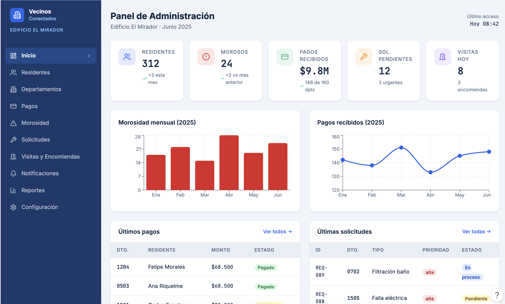
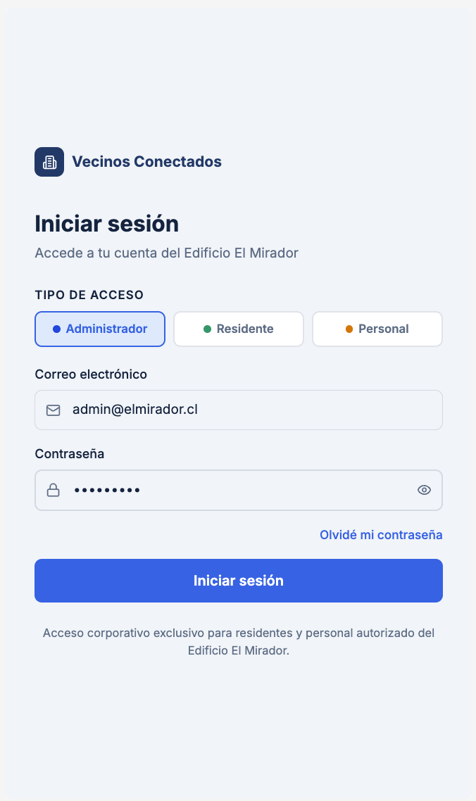
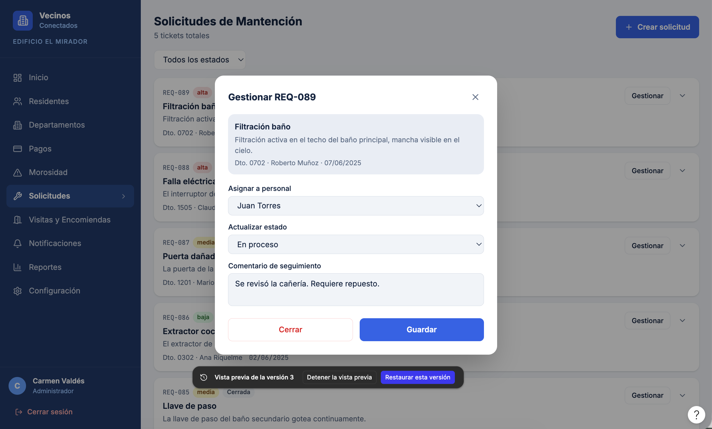
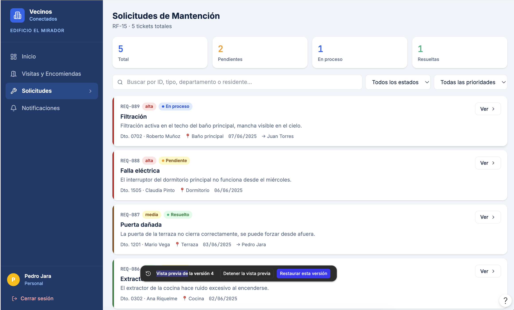
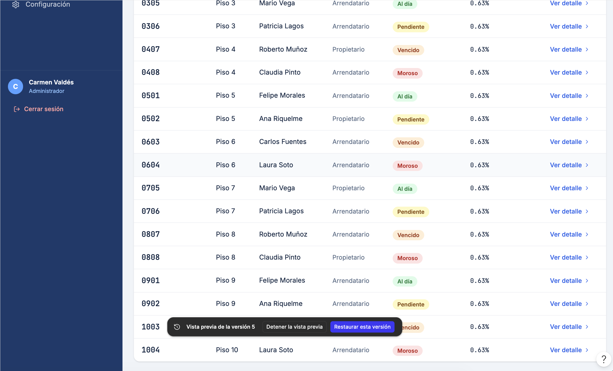
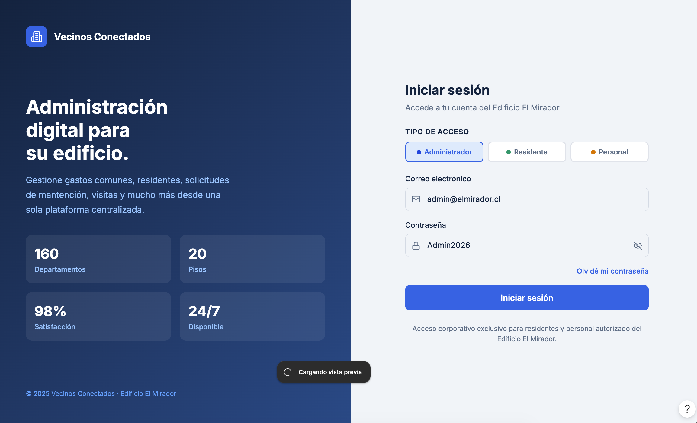
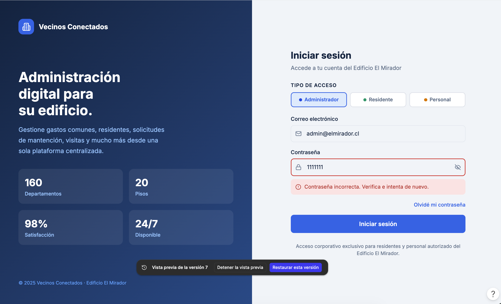
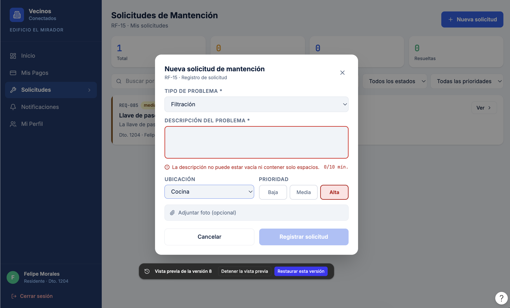
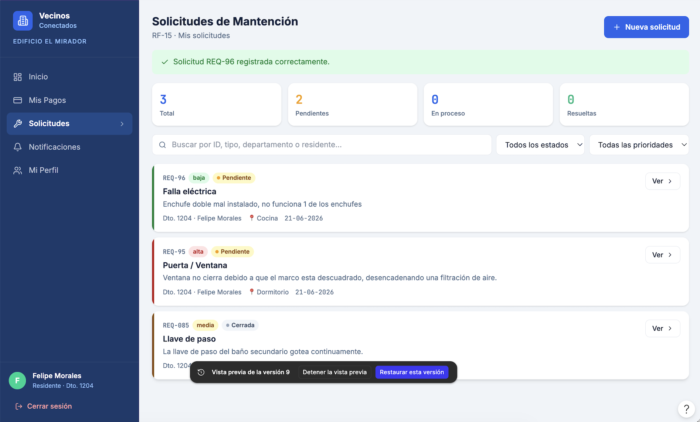
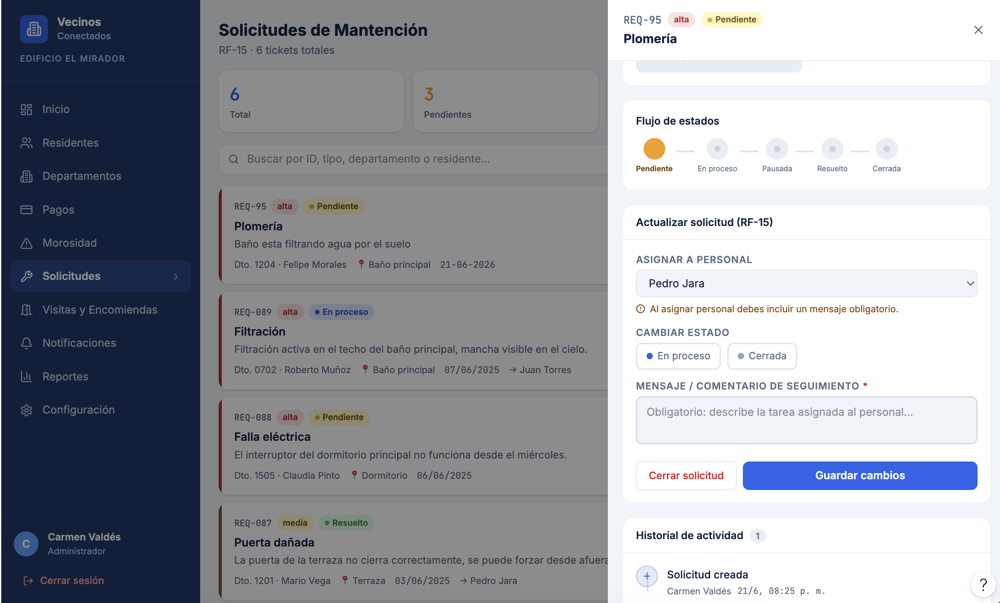

# Vecinos Conectados

## Descripción del Proyecto

**Vecinos Conectados** es una plataforma orientada a la administración del edificio **El Mirador**, diseñada para digitalizar y optimizar los procesos administrativos y operacionales de la comunidad.

El sistema permite gestionar residentes, departamentos, gastos comunes, pagos, morosidad, solicitudes de mantención, visitas, encomiendas, notificaciones y reportes, mejorando la comunicación entre la administración y los residentes.

---

## Objetivos del Proyecto

* Digitalizar los procesos administrativos del edificio.
* Facilitar la gestión de pagos y gastos comunes.
* Optimizar la atención de solicitudes de mantención.
* Mejorar la comunicación entre residentes y administración.
* Centralizar la información en una única plataforma.

---

# Tecnologías y Herramientas Utilizadas

* **Figma** – Prototipado de alta fidelidad.
* **GitHub** – Control de versiones y gestión colaborativa.
* **StarUML** – Modelado UML.
* **Draw.io** – Elaboración de diagramas complementarios.

---

# Control de Versiones

## Propósito

El control de versiones tiene como propósito registrar y gestionar las modificaciones realizadas durante el desarrollo del sistema **Vecinos Conectados**, permitiendo mantener un historial organizado de los cambios efectuados en el prototipo y en la documentación del proyecto.

Esto facilita la trazabilidad de las versiones, el seguimiento de las mejoras implementadas y la recuperación de versiones anteriores cuando sea necesario, contribuyendo a un desarrollo más ordenado y controlado.

---

## Tipo de Versionamiento Utilizado

Durante el desarrollo del proyecto se adoptó el **versionamiento semántico**, permitiendo identificar de forma clara la evolución del diseño y de las funcionalidades implementadas mediante una estructura organizada de versiones.

Este esquema facilita el seguimiento de los cambios realizados, la incorporación de nuevos requerimientos, la corrección de errores y la recuperación de versiones anteriores cuando es necesario.

---

# Historial de Versiones

| Versión | Fecha      | Descripción                                                                                                    |
| ------- | ---------- | -------------------------------------------------------------------------------------------------------------- |
| V.1     | 09/06/2026 | Creación del prototipo base e implementación de las instrucciones iniciales del proyecto.                      |
| V.2     | 09/06/2026 | Incorporación del diseño responsivo para dispositivos móviles y escritorio.                                    |
| V.3     | 16/06/2026 | Implementación de los requerimientos funcionales RF-15.                                                        |
| V.4     | 16/06/2026 | Implementación de los demás requerimientos funcionales definidos para el sistema.                              |
| V.5     | 16/06/2026 | Ajuste del color de la pestaña y mejoras visuales de la interfaz.                                              |
| V.6     | 17/06/2026 | Actualización de la pantalla de cambio de contraseña.                                                          |
| V.7     | 17/06/2026 | Implementación de la validación de contraseña.                                                                 |
| V.8     | 17/06/2026 | Validación del campo de descripción de solicitudes.                                                            |
| V.9     | 17/06/2026 | Incorporación de la visualización de solicitudes en el perfil del residente.                                   |
| V.10    | 17/06/2026 | Se agregó la obligatoriedad de la descripción en las solicitudes y se realizaron ajustes finales al prototipo. |

---

# Evidencias de Versiones

## V.1 - Prototipo Base

---

## V.2 - Diseño Responsivo

---

## V.3 - Implementación RF-15

---

## V.4 - Implementación de Requerimientos Funcionales

---

## V.5 - Mejoras Visuales

---

## V.6 - Cambio de Contraseña

---

## V.7 - Validación de Contraseña

---

## V.8 - Validación de Solicitudes

---

## V.9 - Solicitudes en Perfil del Residente

---

## V.10 - Ajustes Finales

---

# Integrantes

* Amaru Burdiles
* Dairys Bernal
* Rocio Bustos

---

# Información Académica

**Asignatura:** Ingeniería de Software
**Profesor:** Ricardo Pino
**Institución:** Duoc UC
**Proyecto:** Vecinos Conectados
**Año:** 2026
